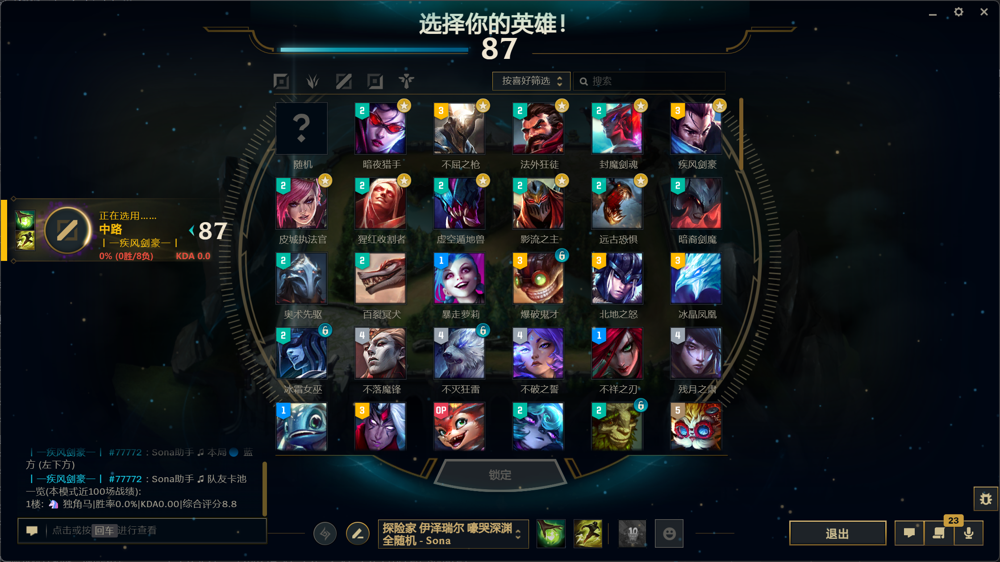
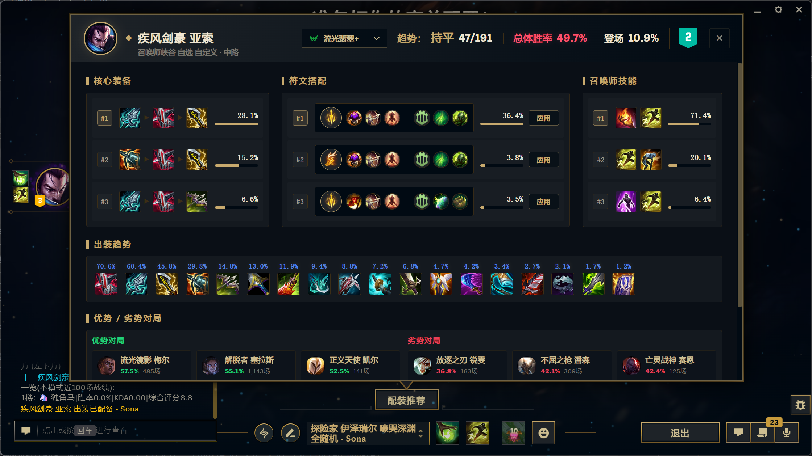
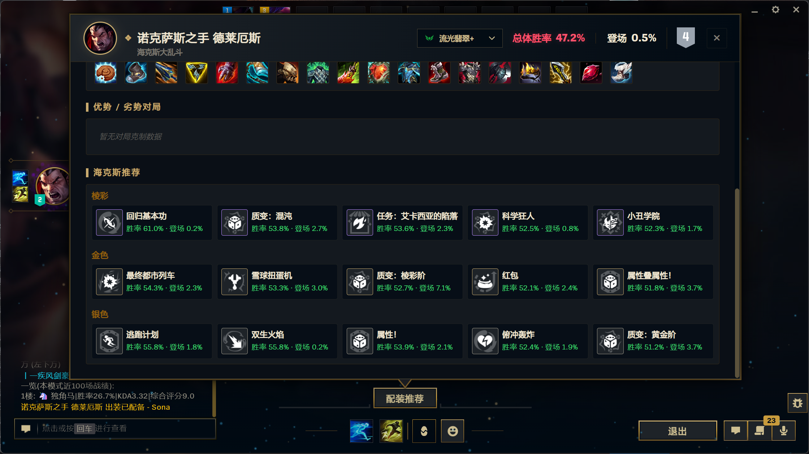
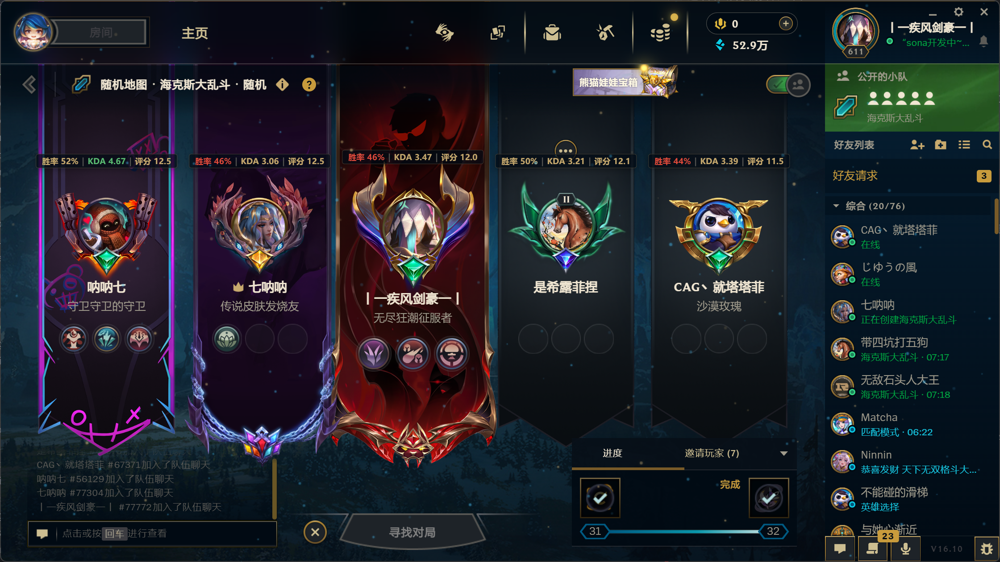
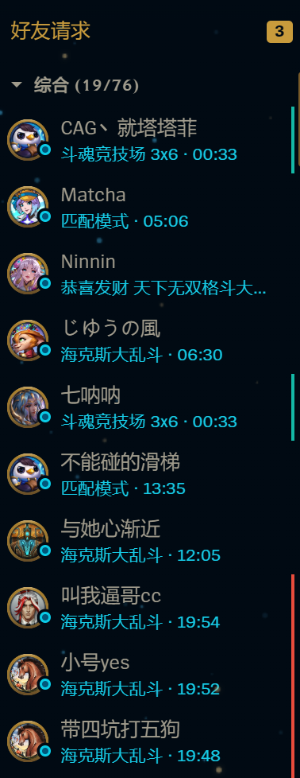
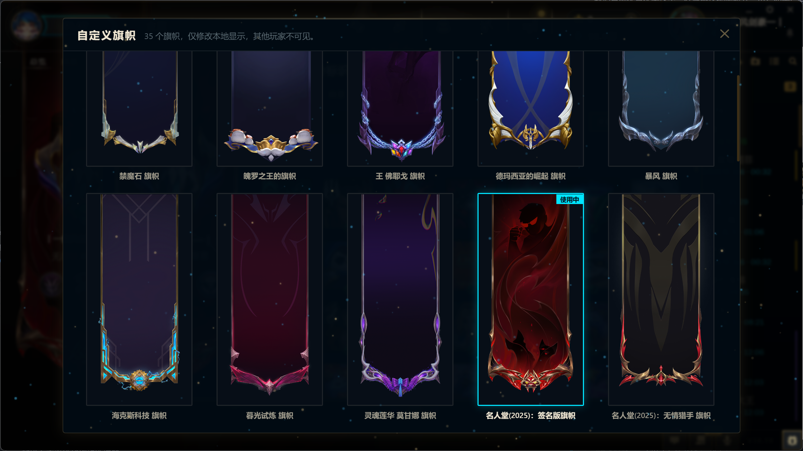

## 一款基于Pengu Loader的全服可用英雄联盟客户端增强插件
<!-- PROJECT SHIELDS -->

<div align="center">

  <a href="https://github.com/WJZ-P/sona/graphs/contributors">
    
  </a>
  &nbsp;
  <a href="https://github.com/WJZ-P/sona/network/members">
    
  </a>
  &nbsp;
  <a href="https://github.com/WJZ-P/sona/stargazers">
    
  </a>
  &nbsp;
  <a href="https://github.com/WJZ-P/sona/issues">
    
  </a>
  &nbsp;
  <a href="https://github.com/WJZ-P/sona/blob/main/LICENSE">
    
  </a>

</div>

<br>

<!-- PROJECT LOGO -->

<p align="center">
  <a href="https://github.com/WJZ-P/sona/">
    
  </a>
</p>

<h1 align="center">Sona</h1>

<p align="center">
  <a href="#-安装">快速开始</a>
  ·
  <a href="https://github.com/WJZ-P/sona/issues">报告 Bug</a>
  ·
  <a href="https://github.com/WJZ-P/sona/issues">提出新特性</a>
</p>

<!-- LYRICS -->


<p align="center">
  <a href="https://www.bilibili.com/video/BV1La4Fz1Een">
    
  </a>
</p>

<h2 align="center">

「当心弦交缠相牵 &nbsp; 花开遍荒芜岁月 &nbsp; 我们相伴在过去与明天」

</h2>

## 目录
- [简介](#简介)
- [功能特性](#功能特性)
- [效果展示](#效果展示)
- [安装](#安装)
- [使用](#使用)
- [技术架构](#技术架构)
- [项目结构](#项目结构)
- [注意事项](#注意事项)
- [交流群](#交流群)
- [To Do List](#to-do-list)
- [License](#license)
- [致谢](#致谢)
- [重要声明](#重要声明)

<br>

<h2 id="简介">简介</h2>

<p align="center">
  
</p>

<p align="center"><em>▲ Sona 插件面板 — 按 F1 随时呼出，集成战绩查询、秒抢英雄、队友分析等丰富功能</em></p>

<br>

<h2 id="功能特性">✨ 功能特性</h2>

### 对局增强

|  | 功能 | 说明 |
|:----:|------|------|
| ⚡ | **自动接受对局** | 匹配到对局时自动点击接受，再也不会错过 |
| 🎯 | **秒选 / 自动 Ban 英雄队列** | 支持配置多个候选英雄，按优先级自动跳过不可用英雄；秒选可选择"秒选并锁定"或"仅预选"模式 |
| 🔄 | **大乱斗无CD换英雄** | 移除共享池英雄的切换冷却限制，随时换取心仪英雄 |
| 📊 | **分析友方战力** | 进入英雄选择时自动查询队友近期战绩，计算胜率、KDA 和综合评分，并按队内排名标记"独角马/上等马/中等马/下等马/纯牛马" |
| 🌟 | **英雄选择阶段增强** | 根据胜率为队友头像添加 5 档粒子特效，底部显示胜率和 KDA；点击队友头像可查看详细战绩 |
| 🏷️ | **英雄 T 级角标** | 在英雄选择网格、备选席和己方头像上展示 OP.GG 英雄 T 级角标 |
| 📈 | **全局战力分析弹窗** | 进入游戏后自动弹窗展示双方队伍战力分析，包括胜率、KDA、段位、开黑分组；客户端内嵌"对局分析"按钮可随时重新打开 |
| 🔁 | **对局结束自动返回房间** | 对局结束后自动返回房间，保留开黑车队；支持"自动排队"和"仅返回房间"两种模式，内置重试机制 |
| 🛡️ | **平衡性调整 buff 提示** | 游玩特定模式（大乱斗、无限火力）时，悬停英雄头像显示对应的平衡性数值调整 |
| 👍 | **对局结束自动点赞** | 对局结束后自动随机给队友点赞 |
| 🧩 | **组队界面增强** | 在组队界面点击成员头像区域查看战绩，并在旗帜上方展示该模式近期胜率、KDA 和综合评分 |

### 智能配装

|  | 功能 | 说明 |
|:---:|------|------|
| 🧠 | **智能配装、符文与召唤师技能** | 锁定英雄后按英雄和模式自动同步装备集；自动记忆并恢复玩家手动保存过的符文与召唤师技能 |
| 🧰 | **OP.GG 配装推荐面板** | 在选人阶段展示当前英雄的装备、符文、召唤师技能、强化符文推荐 |
| 📦 | **自动装备集写入** | 自动生成 Sona 管理的客户端装备集，按胜率排序推荐出门装、鞋子、核心装和后续装备，并保留玩家自建装备集 |
| ⚔️ | **优势 / 劣势对局** | 在 OP.GG 推荐面板展示当前英雄的优势和劣势 matchup |

### 战绩查询

|  | 功能 | 说明 |
|:---:|------|------|
| 🔍 | **任意玩家战绩查询** | 输入召唤师名#Tag，一次性拉取近 100 场对局 |
| 🏷️ | **模式过滤** | 支持按游戏模式下拉筛选（排位/匹配/大乱斗/斗魂等），使用 SGP 接口按队列过滤 |
| 📋 | **详细战报** | 每场显示英雄、KDA、装备、符文、召唤师技能、补刀、金币、伤害 |
| 📎 | **Game ID 复制** | 一键复制 Game ID，配合回放功能使用 |

### 社交

|  | 功能 | 说明 |
|:---:|------|------|
| ✏️ | **解锁自定义签名** | 移除客户端对签名编辑的禁用限制 |
| 🖼️ | **自定义生涯背景** | 可从所有皮肤中选择生涯背景（不限于已拥有），支持搜索和分页懒加载 |
| 🎏 | **自定义挑战旗帜** | 在挑战身份页面选择任意旗帜作为本地展示，支持段位旗帜与未拥有旗帜 |
| 👥 | **开黑好友标记** | 同一对局中的好友用相同颜色标记，一眼看出谁在开黑 |
| ⏱️ | **增强游戏中好友状态** | 右侧好友列表显示游戏中好友的模式和实时对局时长 |
| 🎭 | **段位伪装** | 伪装好友列表中的段位显示，支持黑铁到最强王者任选，一键恢复真实段位 |
| 🚫 | **卸下头像边框** | 一键移除头像框装饰，恢复干净头像 |
| 🧹 | **卸下头像** | 一键恢复客户端默认召唤师头像 |

### 工具

|  | 功能 | 说明 |
|:---:|------|------|
| 🎬 | **回放观看** | 输入 Game ID 自动下载并观看对局回放 |
| 💾 | **设置备份/恢复** | 备份客户端设置（常规配置 + 热键），支持多个命名存档 |
| 🪟 | **窗口特效** | 毛玻璃、亚克力、云母(Win11)等视觉效果 |
| ✨ | **全局粒子美化** | 为客户端添加星光粒子背景效果 |
| 🔧 | **开发者调试面板** | 完整的 LCU API 调试工具，含战绩查询、聊天调试、回放调试、荣誉调试等 |

### 界面

|  | 功能 | 说明 |
|:---:|------|------|
| 🏠 | **Sona 入口** | 客户端 Play 按钮旁的快捷入口 |
| ⌨️ | **快捷键** | 按 F1（可配置 F1~F5）随时呼出/关闭面板 |
| 📱 | **增强在线状态** | 支持手机在线、隐身等额外状态，启动时自动恢复 |
| 🔄 | **DOM 自愈** | 客户端 Ember.js 刷新 DOM 后自动补回所有注入功能 |

<br>

<h2 id="效果展示">🖼️ 效果展示</h2>

### 英雄选择界面增强

<p align="center">
  
</p>

<p align="center"><em>▲ 选人阶段显示队友近期胜率、KDA、头像粒子特效，并支持点击头像查看战绩。</em></p>

### 英雄 T 级展示

<p align="center">
  
</p>

<p align="center"><em>▲ 在英雄选择网格、己方头像和备选席展示 OP.GG T 级角标。</em></p>

### 配装推荐

<p align="center">
  
</p>

<p align="center"><em>▲ 锁定英雄后查看当前模式的 OP.GG 配装、符文和召唤师技能推荐。</em></p>

### 海克斯推荐

<p align="center">
  
</p>

<p align="center"><em>▲ 斗魂、海斗展示海克斯推荐。</em></p>

### 增强组队界面

<p align="center">
  
</p>

<p align="center"><em>▲ 组队界面旗帜上方展示近期表现，点击成员头像区域可打开战绩面板。</em></p>

### 游戏中好友状态

<p align="center">
  
</p>

<p align="center"><em>▲ 好友列表中实时显示游戏中好友的模式与对局时长。</em></p>

### 自定义生涯背景

<p align="center">
  
</p>

<p align="center"><em>▲ 生涯背景选择器支持搜索所有皮肤，包括特殊皮肤与多形态皮肤。</em></p>

### 自定义旗帜

<p align="center">
  
</p>

<p align="center"><em>▲ 在挑战身份页面本地更换任意旗帜，打造更个性化的客户端展示。</em></p>

<br>

<h2 id="安装">📦 安装</h2>

### 前置条件

- [Pengu Loader](https://pengu.lol/) 最新版已安装

### 安装步骤

[Pengu Loader 项目地址](https://github.com/PenguLoader/PenguLoader),安装方式很简单，在release中下载最新版的setup.exe，直接安装即可。安装完成后打开，如下图启用状态为ready则表示安装成功，后续不再需要打开该软件，正常启动LOL即可。如果需要你选择LOL路径，选择到“英雄联盟”文件夹即可。

<p align="center">

</p>

接着点击上方右侧的Plugins,打开插件目录，从本项目的release中下载压缩包(不要下载项目源码使用)，解压出sona文件夹并拖动至插件目录，注意，loader不支持直接拖入文件，应该点击右下角打开插件目录，然后将sona文件夹拖动进去。

<p align="center">

</p>

注意，这里要把sona文件夹拖动进来，并确保里面应该是两个index文件。

<p align="center">

</p>

操作完成后，回到loader，点刷新，像上图一样就是安装成功了，接着重启客户端即可。


## 🚀 使用


1. 启动英雄联盟客户端
2. 点击 Play 按钮旁的 **Sona 头像图标**，或按 **F1** 打开面板
3. 在「工具」页开启/配置各项功能
4. 所有设置自动持久化，下次启动自动恢复

<br>

## 🏗️ 技术架构

```
┌─────────────────────────────────────────────────────┐
│              League Client (Ember.js)                │
│           内置 Chromium 浏览器环境                    │
└──────────────────────┬──────────────────────────────┘
                       │
┌──────────────────────┴──────────────────────────────┐
│                 Pengu Loader v1.1.0+                 │
│          init(context) → load() 生命周期              │
└──────────────────────┬──────────────────────────────┘
                       │
┌──────────────────────┴──────────────────────────────┐
│                    Sona Plugin                       │
│                                                      │
│  ┌─────────────┐  ┌─────────────┐  ┌──────────────┐ │
│  │  React App  │  │  Features   │  │  Injections  │ │
│  │  (面板 UI)  │  │  (功能逻辑) │  │  (DOM 注入)  │ │
│  └──────┬──────┘  └──────┬──────┘  └──────┬───────┘ │
│         │                │                │          │
│  ┌──────┴────────────────┴────────────────┴───────┐ │
│  │              LCUManager (单例)                   │ │
│  │         REST API (fetch) + WebSocket            │ │
│  └────────────────────────────────────────────────┘ │
│                                                      │
│  ┌────────────┐  ┌──────────┐  ┌─────────────────┐  │
│  │ SonaStore  │  │ Assets   │  │ InjectorManager │  │
│  │ (持久配置) │  │ (资源映射)│  │ (DOM 自愈守护)  │  │
│  └────────────┘  └──────────┘  └─────────────────┘  │
└─────────────────────────────────────────────────────┘
```

**核心设计理念：**

- **LCUManager** — REST + WebSocket 双通道统一管理，所有 LCU 交互集中在一个单例中
- **InjectorManager** — 单一 MutationObserver + requestAnimationFrame 节流，注入点被客户端刷掉后自动补回（自愈机制）
- **SonaStore** — 内存缓存 + DataStore 持久化 + 变化监听，类型安全的配置管理
- **功能驱动** — 所有功能通过 store 配置开关控制，监听变化自动开启/关闭

<br>

## 📁 项目结构

```
sona/
├── src/
│   ├── index.tsx                    # 插件入口（init/load 生命周期）
│   ├── App.tsx                      # 主应用（侧边栏 + 页面路由）
│   ├── lib/
│   │   ├── lcu.ts                   # LCU REST API + WebSocket 封装
│   │   ├── features.ts              # 功能生命周期注册与部分选人增强逻辑
│   │   ├── features/                # 独立功能模块（自动接受、自动 Ban、组队增强等）
│   │   ├── store.ts                 # 配置管理（持久化 + 监听）
│   │   ├── injections.ts            # DOM 注入点注册中心
│   │   ├── InjectorManager.ts       # 全局 MutationObserver 守护
│   │   ├── assets.ts                # 游戏资源映射（装备/技能/英雄/符文/队列/地图）
│   │   ├── modal.ts                 # 模态窗口状态 + 快捷键
│   │   ├── hooks.ts                 # React 自定义 hooks
│   │   ├── logger.ts                # 日志系统
│   │   └── utils.ts                 # 工具函数
│   ├── types/
│   │   └── lcu.ts                   # LCU API 完整类型定义
│   ├── components/
│   │   ├── pages/
│   │   │   ├── HomePage.tsx         # 主页（头像 + 粒子动画）
│   │   │   ├── ToolsPage.tsx        # 工具页（核心功能面板）
│   │   │   ├── SettingsPage.tsx     # 设置页
│   │   │   ├── AboutPage.tsx        # 关于页
│   │   │   └── DebugPage.tsx        # 调试页（开发者模式）
│   │   └── ui/
│   │       ├── Modal.tsx            # 通用模态窗口（createPortal）
│   │       ├── Sidebar.tsx          # 侧边栏导航
│   │       ├── MatchHistoryModal.tsx # 战绩查询弹窗
│   │       ├── GameAnalysisModal.tsx # 对局战力分析弹窗
│   │       ├── ProfileBackgroundPicker.tsx  # 生涯背景选择器
│   │       ├── ChampSelectIconEffect.tsx    # 选人阶段头像粒子特效
│   │       ├── SettingCard.tsx       # 设置卡片
│   │       ├── SonaButton.tsx       # 按钮
│   │       ├── SonaSwitch.tsx       # 开关
│   │       ├── SonaSelect.tsx       # 下拉选择
│   │       ├── SonaInput.tsx        # 输入框
│   │       ├── SonaSlider.tsx       # 滑块
│   │       ├── SonaCheckbox.tsx     # 复选框
│   │       └── icons.tsx            # 图标集
│   └── styles/                      # 18 个 CSS 文件
├── .github/
│   └── workflows/
│       └── release.yml              # CI：推 tag 自动构建 + 发布 Release
├── assets/                          # 静态资源（Sona 头像）
├── CHANGELOG.md                     # 版本变更日志
├── pengu.d.ts                       # Pengu Loader API 类型声明
├── package.json
├── tsconfig.json
├── vite.config.ts
└── LICENSE                          # AGPL-3.0
```

<br>

## ⚠️ 注意事项

1. **需要 Pengu Loader** — 本插件运行在 Pengu Loader 之上，不能独立使用。请先安装 [Pengu Loader](https://pengu.lol/) v1.1.0+。

2. **客户端环境限制** — 插件运行在英雄联盟客户端内置浏览器中，直接通过 fetch 调用 LCU API，无需额外配置端口或 Token。

3. **功能安全性** — 所有功能仅通过官方 LCU API 实现，不修改游戏文件，不注入游戏进程。段位伪装仅影响好友列表名片，不影响实际排位数据。

4. **设置备份** — 备份存储在 Sona DataStore 中，按 PUUID 隔离不同账号，避免客户端重启后丢失。

5. **战绩查询** — 战绩查询优先使用 SGP 接口，支持按队列模式过滤；部分大区、网络或客户端状态异常时可能查询失败。

<br>

<h2 id="交流群">💬 交流群</h2>

欢迎加入交流群一起讨论使用技巧、反馈问题或提建议！

<p align="center">
  
</p>

<br>

<h2 id="to-do-list">📝 To Do List</h2>

- [x] **自动接受对局**
- [x] **大乱斗无CD换英雄**
- [x] **秒选 / 自动 Ban 英雄队列**（按优先级跳过不可用英雄）
- [x] **队友战力分析**（自动查战绩 + 综合评分 + 聊天框发送）
- [x] **英雄选择头像粒子特效**（5 档胜率视觉反馈）
- [x] **战绩查询系统**（100 场贪婪拉取 + 模式过滤）
- [x] **智能配装、符文与召唤师技能**（按英雄和模式自动同步与恢复）
- [x] **OP.GG 配装推荐面板**（装备/符文/召唤师技能/强化符文/matchup）
- [x] **自定义生涯背景**（全皮肤选择器）
- [x] **自定义挑战旗帜**
- [x] **开黑好友标记**（同局好友颜色分组）
- [x] **增强游戏中好友状态**（模式 + 实时对局时长）
- [x] **组队界面增强**（点击头像看战绩 + 近期表现）
- [x] **段位伪装**
- [x] **回放下载 & 观看**
- [x] **设置备份/恢复**（常规配置 + 热键双通道，DataStore 持久化）
- [x] **增强在线状态**（手机在线/隐身 + 持久化恢复）
- [x] **全局粒子美化**
- [x] **全局战力分析弹窗**（双方胜率/KDA/段位/开黑分组 + 客户端内嵌按钮）
- [x] **对局结束自动返回房间**（自动排队/仅返回房间 + 开黑车队保留 + 重试机制）
- [x] **平衡性调整 buff 提示**（大乱斗/无限火力数值调整悬停展示）
- [x] **DOM 自愈注入机制**
- [ ] **多语言支持**
- [ ] **对局数据看板**（实时数据统计）

<br>

## 📄 License

该项目签署了 AGPL-3.0 授权许可，详情请参阅 [LICENSE](https://github.com/WJZ-P/sona/blob/main/LICENSE)

<br>

<div align="center">

Made by **WJZ_P** with love ❤

</div>

<br>

## 🐧 LINUX DO

本项目支持 [LINUX DO](https://linux.do) 社区

<br>

<br>

<h2 id="致谢">💝 致谢</h2>

Sona 能走到今天，离不开这些前辈们的无私开源。站在前人的肩膀上，我才能看得更远。在此郑重感谢这些项目，我从它们的代码里学到了很多，真的超级感谢大家～ ₍ᐢ..ᐢ₎♡

- [**BakaFT / BetterTencentLCU**](https://github.com/BakaFT/BetterTencentLCU)
- [**imunproductive / upl**](https://github.com/imunproductive/upl)
- [**BakaFT / CustomHookLoader**](https://github.com/BakaFT/CustomHookLoader) 
- [**nomi-san / balance-buff-viewer**](https://github.com/nomi-san/balance-buff-viewer) 
- [**LeagueAkari / LeagueAkari**](https://github.com/LeagueAkari/LeagueAkari) 

每一个 commit、每一行注释、每一个巧妙的设计，都是前辈们留给社区的珍贵财富。Sona 只是一个小小的学习者，未来也会把自己学到的东西继续开源回馈出去。感谢每一位奉献者 ✨

<br>

<h2 id="重要声明">📢 重要声明</h2>

> 由于项目的特殊性，本项目 **不接受任何形式的赞助** ᕙ(⇀‸↼‶)ᕗ
>
> 也 **不接受 Pull Request** (｡•́︿•̀｡)
>
> 但是非常欢迎提出建议和反馈！请到 [Issues](https://github.com/WJZ-P/sona/issues) 畅所欲言～ ₍ᐢ..ᐢ₎♡

<br>

## 如果觉得好用，请给个 ⭐ 支持一下！ ٩(◕‿◕｡)۶

## ⭐ Star 历史

[](https://starchart.cc/WJZ-P/sona)
